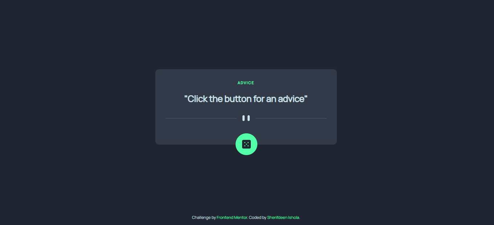

# Frontend Mentor - Advice generator app solution

This is a solution to the [Advice generator app challenge on Frontend Mentor](https://www.frontendmentor.io/challenges/advice-generator-app-QdUG-13db). Frontend Mentor challenges help you improve your coding skills by building realistic projects.

## Table of contents

- [Overview](#overview)
  - [The challenge](#the-challenge)
  - [Screenshot](#screenshot)
  - [Links](#links)
- [My process](#my-process)
  - [Built with](#built-with)
  - [What I learned](#what-i-learned)
- [Author](#author)


## Overview

### The challenge

Users should be able to:

- View the optimal layout for the app depending on their device's screen size
- See hover states for all interactive elements on the page
- Generate a new piece of advice by clicking the dice icon

### Screenshot




### Links

- Solution URL: [Add solution URL here](https://your-solution-url.com)
- Live Site URL: [Add live site URL here](https://your-live-site-url.com)

## My process

### Built with

- Semantic HTML5 markup
- CSS custom properties
- Flexbox
- Mobile-first workflow


### What I learned


```js
 fetch(endpoint, {
        method: "GET"
    })
        .then(response => response.json())
        .then(data => {
            console.log(data.slip.advice);
            document.querySelector("#id").innerHTML = `advice ${data.slip.id}`
            document.querySelector("#advice").innerHTML = data.slip.advice
        })
        .catch(err => console.log(err))
```


## Author

- LinkedIn - [Sherifdeen Ishola](https://www.linkedin.com/in/sherifdeen-ishola-501798154/)
- Frontend Mentor - [@boogiedml](https://www.frontendmentor.io/profile/boogiedml)
- Twitter - [@boogiedml](https://www.twitter.com/boogiedml)

